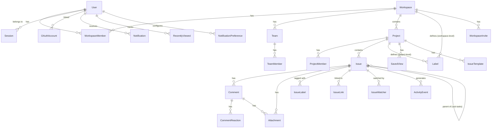

# Part 18: Complete Data Model (Phase 1)

## Entity Relationship Diagram



## All Entities (Phase 1)

### User & Auth

```sql
-- Core user
CREATE TABLE users (
  id UUID PRIMARY KEY DEFAULT gen_random_uuid(),
  email VARCHAR(255) NOT NULL UNIQUE,
  email_verified BOOLEAN NOT NULL DEFAULT FALSE,
  password_hash VARCHAR(255), -- nullable for OAuth-only users
  full_name VARCHAR(100) NOT NULL,
  display_name VARCHAR(100),
  avatar_url TEXT,
  totp_secret TEXT, -- encrypted
  totp_enabled BOOLEAN NOT NULL DEFAULT FALSE,
  backup_codes TEXT[], -- hashed
  locked_until TIMESTAMPTZ,
  failed_login_attempts INT NOT NULL DEFAULT 0,
  created_at TIMESTAMPTZ NOT NULL DEFAULT NOW(),
  updated_at TIMESTAMPTZ NOT NULL DEFAULT NOW()
);

-- Sessions
CREATE TABLE sessions (
  id UUID PRIMARY KEY DEFAULT gen_random_uuid(),
  user_id UUID NOT NULL REFERENCES users(id) ON DELETE CASCADE,
  refresh_token_hash VARCHAR(255) NOT NULL,
  device_info TEXT,
  ip_address INET,
  user_agent TEXT,
  last_active_at TIMESTAMPTZ NOT NULL DEFAULT NOW(),
  expires_at TIMESTAMPTZ NOT NULL,
  created_at TIMESTAMPTZ NOT NULL DEFAULT NOW()
);

-- OAuth linked accounts
CREATE TABLE oauth_accounts (
  id UUID PRIMARY KEY DEFAULT gen_random_uuid(),
  user_id UUID NOT NULL REFERENCES users(id) ON DELETE CASCADE,
  provider VARCHAR(20) NOT NULL, -- google, github, microsoft
  provider_user_id VARCHAR(255) NOT NULL,
  provider_email VARCHAR(255),
  access_token TEXT, -- encrypted
  refresh_token TEXT, -- encrypted
  created_at TIMESTAMPTZ NOT NULL DEFAULT NOW(),
  UNIQUE (provider, provider_user_id)
);

-- Password reset tokens
CREATE TABLE password_reset_tokens (
  id UUID PRIMARY KEY DEFAULT gen_random_uuid(),
  user_id UUID NOT NULL REFERENCES users(id) ON DELETE CASCADE,
  token_hash VARCHAR(255) NOT NULL,
  used BOOLEAN NOT NULL DEFAULT FALSE,
  expires_at TIMESTAMPTZ NOT NULL,
  created_at TIMESTAMPTZ NOT NULL DEFAULT NOW()
);

-- Email verification tokens
CREATE TABLE email_verification_tokens (
  id UUID PRIMARY KEY DEFAULT gen_random_uuid(),
  user_id UUID NOT NULL REFERENCES users(id) ON DELETE CASCADE,
  token_hash VARCHAR(255) NOT NULL,
  used BOOLEAN NOT NULL DEFAULT FALSE,
  expires_at TIMESTAMPTZ NOT NULL,
  created_at TIMESTAMPTZ NOT NULL DEFAULT NOW()
);
```

### Workspace

```sql
CREATE TABLE workspaces (
  id UUID PRIMARY KEY DEFAULT gen_random_uuid(),
  name VARCHAR(50) NOT NULL,
  slug VARCHAR(30) NOT NULL UNIQUE,
  logo_url TEXT,
  timezone VARCHAR(50) NOT NULL DEFAULT 'UTC',
  date_format VARCHAR(10) NOT NULL DEFAULT 'YMD', -- DMY, MDY, YMD
  time_format VARCHAR(5) NOT NULL DEFAULT '24h', -- 12h, 24h
  working_days INT[] NOT NULL DEFAULT '{1,2,3,4,5}', -- 0=Sun..6=Sat
  week_start_day INT NOT NULL DEFAULT 1, -- 0=Sun..6=Sat
  default_issue_type VARCHAR(20) NOT NULL DEFAULT 'task',
  default_priority VARCHAR(20) NOT NULL DEFAULT 'medium',
  owner_id UUID NOT NULL REFERENCES users(id),
  deleted_at TIMESTAMPTZ,
  created_at TIMESTAMPTZ NOT NULL DEFAULT NOW(),
  updated_at TIMESTAMPTZ NOT NULL DEFAULT NOW()
);

CREATE TABLE workspace_members (
  id UUID PRIMARY KEY DEFAULT gen_random_uuid(),
  workspace_id UUID NOT NULL REFERENCES workspaces(id) ON DELETE CASCADE,
  user_id UUID NOT NULL REFERENCES users(id) ON DELETE CASCADE,
  role VARCHAR(20) NOT NULL DEFAULT 'member', -- owner, admin, member, guest
  joined_at TIMESTAMPTZ NOT NULL DEFAULT NOW(),
  invited_by UUID REFERENCES users(id),
  UNIQUE (workspace_id, user_id)
);

CREATE TABLE workspace_invites (
  id UUID PRIMARY KEY DEFAULT gen_random_uuid(),
  workspace_id UUID NOT NULL REFERENCES workspaces(id) ON DELETE CASCADE,
  email VARCHAR(255) NOT NULL,
  role VARCHAR(20) NOT NULL DEFAULT 'member',
  token_hash VARCHAR(255) NOT NULL,
  invited_by UUID NOT NULL REFERENCES users(id),
  accepted_at TIMESTAMPTZ,
  expires_at TIMESTAMPTZ NOT NULL,
  created_at TIMESTAMPTZ NOT NULL DEFAULT NOW()
);

CREATE TABLE teams (
  id UUID PRIMARY KEY DEFAULT gen_random_uuid(),
  workspace_id UUID NOT NULL REFERENCES workspaces(id) ON DELETE CASCADE,
  name VARCHAR(50) NOT NULL,
  description TEXT,
  color VARCHAR(7) NOT NULL DEFAULT '#3b82f6',
  lead_id UUID REFERENCES users(id),
  created_at TIMESTAMPTZ NOT NULL DEFAULT NOW(),
  updated_at TIMESTAMPTZ NOT NULL DEFAULT NOW()
);

CREATE TABLE team_members (
  team_id UUID NOT NULL REFERENCES teams(id) ON DELETE CASCADE,
  user_id UUID NOT NULL REFERENCES users(id) ON DELETE CASCADE,
  added_at TIMESTAMPTZ NOT NULL DEFAULT NOW(),
  PRIMARY KEY (team_id, user_id)
);
```

### Project

```sql
CREATE TABLE projects (
  id UUID PRIMARY KEY DEFAULT gen_random_uuid(),
  workspace_id UUID NOT NULL REFERENCES workspaces(id) ON DELETE CASCADE,
  name VARCHAR(100) NOT NULL,
  key VARCHAR(10) NOT NULL, -- uppercase, unique per workspace
  description TEXT, -- markdown
  icon_emoji VARCHAR(10),
  icon_color VARCHAR(7),
  visibility VARCHAR(10) NOT NULL DEFAULT 'public', -- public, private
  lead_id UUID REFERENCES users(id),
  default_assignee_id UUID REFERENCES users(id),
  default_assignee_rule VARCHAR(20) NOT NULL DEFAULT 'none', -- none, project_lead, specific_user
  issue_counter INT NOT NULL DEFAULT 0,
  archived_at TIMESTAMPTZ,
  deleted_at TIMESTAMPTZ,
  created_by UUID NOT NULL REFERENCES users(id),
  created_at TIMESTAMPTZ NOT NULL DEFAULT NOW(),
  updated_at TIMESTAMPTZ NOT NULL DEFAULT NOW(),
  UNIQUE (workspace_id, key)
);

CREATE TABLE project_members (
  id UUID PRIMARY KEY DEFAULT gen_random_uuid(),
  project_id UUID NOT NULL REFERENCES projects(id) ON DELETE CASCADE,
  user_id UUID NOT NULL REFERENCES users(id) ON DELETE CASCADE,
  role VARCHAR(20) NOT NULL DEFAULT 'member', -- admin, member, viewer
  added_at TIMESTAMPTZ NOT NULL DEFAULT NOW(),
  added_by UUID REFERENCES users(id),
  UNIQUE (project_id, user_id)
);

CREATE TABLE project_favorites (
  user_id UUID NOT NULL REFERENCES users(id) ON DELETE CASCADE,
  project_id UUID NOT NULL REFERENCES projects(id) ON DELETE CASCADE,
  created_at TIMESTAMPTZ NOT NULL DEFAULT NOW(),
  PRIMARY KEY (user_id, project_id)
);
```

### Issue

```sql
CREATE TABLE issues (
  id UUID PRIMARY KEY DEFAULT gen_random_uuid(),
  project_id UUID NOT NULL REFERENCES projects(id) ON DELETE CASCADE,
  workspace_id UUID NOT NULL REFERENCES workspaces(id),
  number INT NOT NULL, -- auto-increment per project
  title VARCHAR(255) NOT NULL,
  description TEXT, -- markdown
  description_html TEXT, -- rendered, cached
  status VARCHAR(50) NOT NULL DEFAULT 'todo',
  status_category VARCHAR(20) NOT NULL DEFAULT 'todo', -- todo, in_progress, done
  priority VARCHAR(20) NOT NULL DEFAULT 'medium', -- critical, high, medium, low, none
  type VARCHAR(20) NOT NULL DEFAULT 'task', -- story, bug, task, subtask
  assignee_id UUID REFERENCES users(id),
  reporter_id UUID NOT NULL REFERENCES users(id),
  story_points INT,
  due_date DATE,
  start_date DATE,
  parent_id UUID REFERENCES issues(id), -- sub-task parent
  sort_order BIGINT NOT NULL DEFAULT 0, -- for manual ordering
  resolved_at TIMESTAMPTZ,
  deleted_at TIMESTAMPTZ,
  created_at TIMESTAMPTZ NOT NULL DEFAULT NOW(),
  updated_at TIMESTAMPTZ NOT NULL DEFAULT NOW(),
  UNIQUE (project_id, number)
);

-- Full-text search index
-- CREATE INDEX issues_search_idx ON issues USING GIN (
--   to_tsvector('english', title || ' ' || COALESCE(description, ''))
-- );

CREATE TABLE labels (
  id UUID PRIMARY KEY DEFAULT gen_random_uuid(),
  workspace_id UUID NOT NULL REFERENCES workspaces(id) ON DELETE CASCADE,
  project_id UUID REFERENCES projects(id) ON DELETE CASCADE, -- null = workspace-level
  name VARCHAR(50) NOT NULL,
  color VARCHAR(7) NOT NULL,
  sort_order INT NOT NULL DEFAULT 0,
  created_by UUID NOT NULL REFERENCES users(id),
  created_at TIMESTAMPTZ NOT NULL DEFAULT NOW(),
  updated_at TIMESTAMPTZ NOT NULL DEFAULT NOW()
);

CREATE TABLE issue_labels (
  issue_id UUID NOT NULL REFERENCES issues(id) ON DELETE CASCADE,
  label_id UUID NOT NULL REFERENCES labels(id) ON DELETE CASCADE,
  added_by UUID REFERENCES users(id),
  added_at TIMESTAMPTZ NOT NULL DEFAULT NOW(),
  PRIMARY KEY (issue_id, label_id)
);

CREATE TABLE issue_links (
  id UUID PRIMARY KEY DEFAULT gen_random_uuid(),
  source_issue_id UUID NOT NULL REFERENCES issues(id) ON DELETE CASCADE,
  target_issue_id UUID NOT NULL REFERENCES issues(id) ON DELETE CASCADE,
  link_type VARCHAR(20) NOT NULL, -- blocks, relates, duplicates
  created_by UUID NOT NULL REFERENCES users(id),
  created_at TIMESTAMPTZ NOT NULL DEFAULT NOW(),
  UNIQUE (source_issue_id, target_issue_id, link_type)
);

CREATE TABLE issue_watchers (
  issue_id UUID NOT NULL REFERENCES issues(id) ON DELETE CASCADE,
  user_id UUID NOT NULL REFERENCES users(id) ON DELETE CASCADE,
  PRIMARY KEY (issue_id, user_id)
);

CREATE TABLE issue_templates (
  id UUID PRIMARY KEY DEFAULT gen_random_uuid(),
  project_id UUID NOT NULL REFERENCES projects(id) ON DELETE CASCADE,
  name VARCHAR(100) NOT NULL,
  title_pattern VARCHAR(255),
  description_template TEXT,
  type VARCHAR(20),
  priority VARCHAR(20),
  label_ids UUID[],
  assignee_id UUID REFERENCES users(id),
  sort_order INT NOT NULL DEFAULT 0,
  created_by UUID NOT NULL REFERENCES users(id),
  created_at TIMESTAMPTZ NOT NULL DEFAULT NOW(),
  updated_at TIMESTAMPTZ NOT NULL DEFAULT NOW()
);
```

### Comments & Activity

```sql
CREATE TABLE comments (
  id UUID PRIMARY KEY DEFAULT gen_random_uuid(),
  issue_id UUID NOT NULL REFERENCES issues(id) ON DELETE CASCADE,
  author_id UUID NOT NULL REFERENCES users(id),
  parent_comment_id UUID REFERENCES comments(id), -- for replies
  body_markdown TEXT NOT NULL,
  body_html TEXT, -- rendered, cached
  is_pinned BOOLEAN NOT NULL DEFAULT FALSE,
  edited_at TIMESTAMPTZ,
  deleted_at TIMESTAMPTZ,
  created_at TIMESTAMPTZ NOT NULL DEFAULT NOW(),
  updated_at TIMESTAMPTZ NOT NULL DEFAULT NOW()
);

CREATE TABLE comment_reactions (
  id UUID PRIMARY KEY DEFAULT gen_random_uuid(),
  comment_id UUID NOT NULL REFERENCES comments(id) ON DELETE CASCADE,
  user_id UUID NOT NULL REFERENCES users(id) ON DELETE CASCADE,
  emoji VARCHAR(10) NOT NULL,
  created_at TIMESTAMPTZ NOT NULL DEFAULT NOW(),
  UNIQUE (comment_id, user_id, emoji)
);

CREATE TABLE activity_events (
  id UUID PRIMARY KEY DEFAULT gen_random_uuid(),
  workspace_id UUID NOT NULL REFERENCES workspaces(id),
  project_id UUID REFERENCES projects(id),
  issue_id UUID REFERENCES issues(id),
  actor_id UUID NOT NULL REFERENCES users(id),
  event_type VARCHAR(50) NOT NULL,
  field_name VARCHAR(50),
  old_value TEXT, -- JSON
  new_value TEXT, -- JSON
  metadata JSONB,
  created_at TIMESTAMPTZ NOT NULL DEFAULT NOW()
);

CREATE INDEX activity_issue_idx ON activity_events (issue_id, created_at DESC);
CREATE INDEX activity_project_idx ON activity_events (project_id, created_at DESC);
```

### Attachments

```sql
CREATE TABLE attachments (
  id UUID PRIMARY KEY DEFAULT gen_random_uuid(),
  issue_id UUID NOT NULL REFERENCES issues(id) ON DELETE CASCADE,
  comment_id UUID REFERENCES comments(id),
  uploaded_by UUID NOT NULL REFERENCES users(id),
  filename VARCHAR(255) NOT NULL,
  storage_key TEXT NOT NULL,
  content_type VARCHAR(100) NOT NULL,
  size_bytes BIGINT NOT NULL,
  width INT, -- images only
  height INT, -- images only
  thumbnail_url TEXT,
  deleted_at TIMESTAMPTZ,
  created_at TIMESTAMPTZ NOT NULL DEFAULT NOW()
);
```

### Notifications

```sql
CREATE TABLE notifications (
  id UUID PRIMARY KEY DEFAULT gen_random_uuid(),
  workspace_id UUID NOT NULL REFERENCES workspaces(id),
  recipient_id UUID NOT NULL REFERENCES users(id),
  actor_id UUID NOT NULL REFERENCES users(id),
  type VARCHAR(50) NOT NULL,
  issue_id UUID REFERENCES issues(id),
  project_id UUID REFERENCES projects(id),
  comment_id UUID REFERENCES comments(id),
  title TEXT NOT NULL,
  read_at TIMESTAMPTZ,
  snoozed_until TIMESTAMPTZ,
  email_sent BOOLEAN NOT NULL DEFAULT FALSE,
  group_key VARCHAR(255),
  created_at TIMESTAMPTZ NOT NULL DEFAULT NOW()
);

CREATE INDEX notifications_unread_idx ON notifications (recipient_id, created_at DESC) WHERE read_at IS NULL;

CREATE TABLE notification_preferences (
  id UUID PRIMARY KEY DEFAULT gen_random_uuid(),
  user_id UUID NOT NULL REFERENCES users(id) ON DELETE CASCADE,
  workspace_id UUID NOT NULL REFERENCES workspaces(id) ON DELETE CASCADE,
  notification_type VARCHAR(50) NOT NULL,
  in_app_enabled BOOLEAN NOT NULL DEFAULT TRUE,
  email_enabled BOOLEAN NOT NULL DEFAULT FALSE,
  UNIQUE (user_id, workspace_id, notification_type)
);
```

### Views & Misc

```sql
CREATE TABLE saved_views (
  id UUID PRIMARY KEY DEFAULT gen_random_uuid(),
  project_id UUID NOT NULL REFERENCES projects(id) ON DELETE CASCADE,
  name VARCHAR(100) NOT NULL,
  filters JSONB NOT NULL DEFAULT '{}',
  sort JSONB NOT NULL DEFAULT '[]',
  grouping VARCHAR(20),
  columns JSONB NOT NULL DEFAULT '[]',
  is_default BOOLEAN NOT NULL DEFAULT FALSE,
  shared BOOLEAN NOT NULL DEFAULT FALSE,
  created_by UUID NOT NULL REFERENCES users(id),
  created_at TIMESTAMPTZ NOT NULL DEFAULT NOW(),
  updated_at TIMESTAMPTZ NOT NULL DEFAULT NOW()
);

CREATE TABLE recently_viewed (
  user_id UUID NOT NULL REFERENCES users(id) ON DELETE CASCADE,
  issue_id UUID NOT NULL REFERENCES issues(id) ON DELETE CASCADE,
  viewed_at TIMESTAMPTZ NOT NULL DEFAULT NOW(),
  PRIMARY KEY (user_id, issue_id)
);
```

## Entity Count Summary (Phase 1)

| Entity | Table Count |
|--------|-----------|
| Auth & User | 5 (users, sessions, oauth_accounts, password_reset_tokens, email_verification_tokens) |
| Workspace | 5 (workspaces, workspace_members, workspace_invites, teams, team_members) |
| Project | 3 (projects, project_members, project_favorites) |
| Issue | 6 (issues, labels, issue_labels, issue_links, issue_watchers, issue_templates) |
| Comments | 2 (comments, comment_reactions) |
| Activity | 1 (activity_events) |
| Attachments | 1 (attachments) |
| Notifications | 2 (notifications, notification_preferences) |
| Views | 2 (saved_views, recently_viewed) |
| **Total** | **27 tables** |
```
